# Hello FastAPI

Létre hozunk egy egyszerű Python FastAPI applikációt.

## FastAPI applikáció
### Virtuális környezet létrehozása
A Python virtuális környezetet egyetlen gombnyomással fogjuk létrehozni, több parancs összefűzésével.

    mkdir hello-fastapi && cd hello-fastapi && python3 -m venv venv && source venv/bin/activate

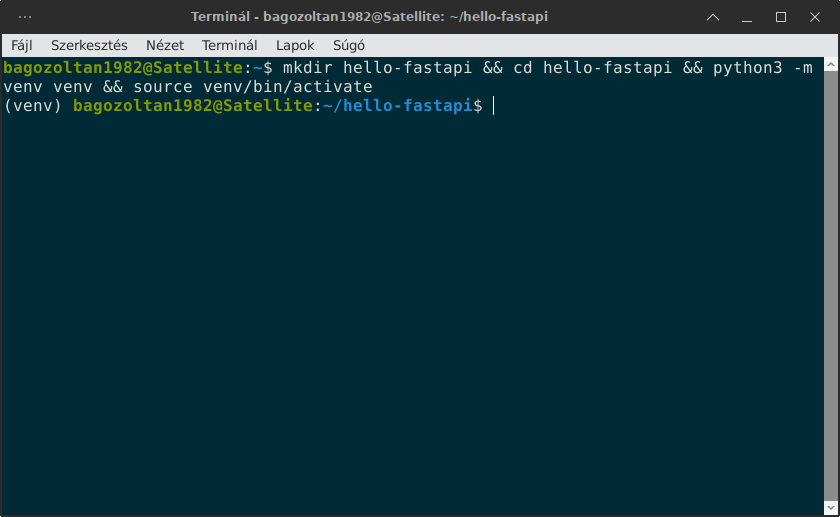

A folyamat végére már fut is a virtuális környezetünk.

### FastAPI könyvtár telepítése
A következő lépésben telepítjük a FastAPI standard könyvtárát. Ehhez a pip lesz a segítségünkre.

    pip install "fastapi[standard]"

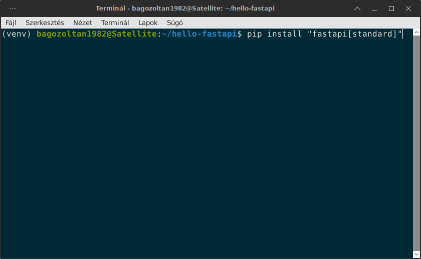

A folyamat végére minden szükséges dolog felkerül oda, ahová kell.

### A main.py fájl létrehozása
A main.py fájlt a beépített nano szerkesztő segítségével hozzuk létre.

nano main.py

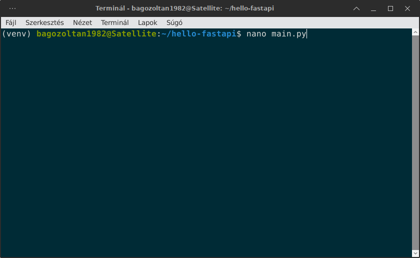

Miután bent vagyunk a nano szerkesztőben írjuk be a következő kodsorokat:

    from fastapi import FastAPI

    app = FastAPI()

    @app.get("/")
    async def hello():
        return {"message": "Hello Fastapi!"}

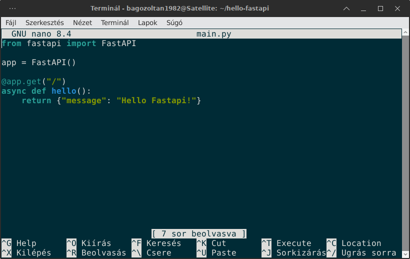

Mentés, aztán lépjünk ki a szerkesztőből.

### FastAPI szerver futtatása
Indítsuk el a FastAPI szervert:

    fastapi dev

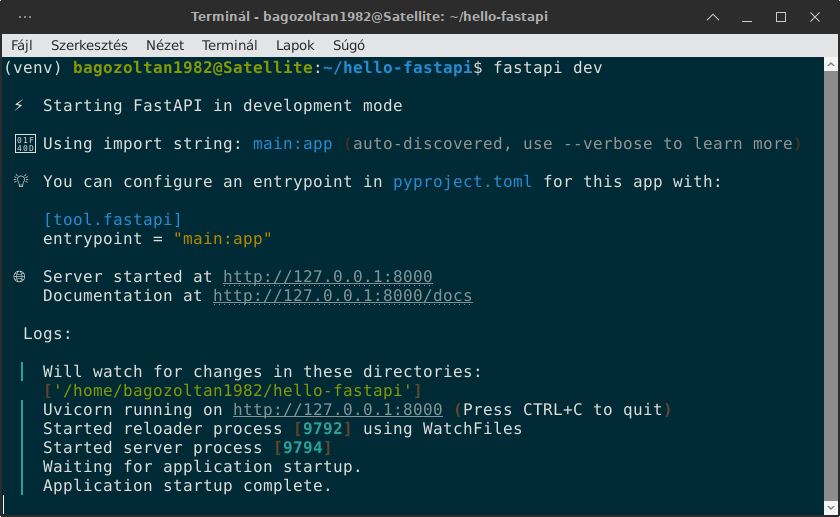

Mivel minden rendben van, ezért nyissuk meg a böngészőnket a http://localhost:8000 porton.
 
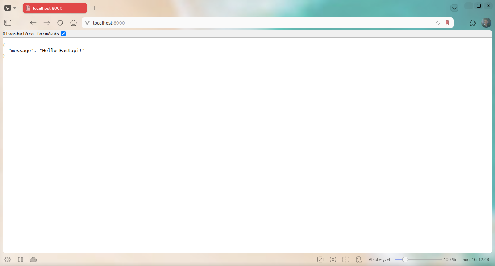

Láthatjuk, hogy a localhost:8000 porton megjelent a rövid kis üzenetünk JSON formátumban.

### Végpont elérése
Nyissunk meg egy másik terminál ablakot és hazsnáljuk a Curl-t, hogy elelnörizzük vele a végpontunkat.

    curl -X GET http://localhost:8000

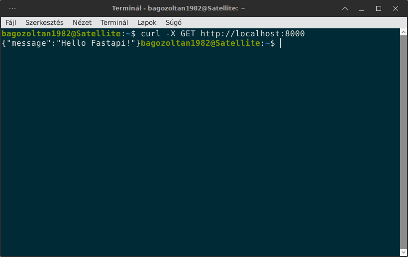

A kimenetben látható, hogy megjelenik az üzenet tartalma:

    {"message": "Hello FastAPI!"}

Végül nézzük meg a terminált is, amelyben a FastAPI éppen fut:

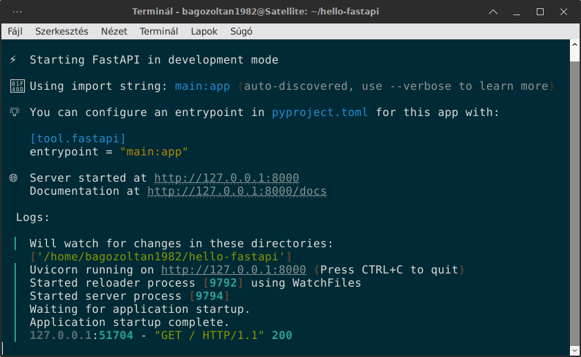

Látható, hogy van egy GET és 200-as kód, ami jót jelent. 

Ezzel meg is vagyunk. Most pedig bele kezdünk a Docker konténer létrehozásába.

## Docker konténer létrehozása

### Requirements.txt
Elöször hozzuk létre a requirements.txt fájlt a pip freeze segítségével:

    pip freeze > requirements.txt

Nézzük meg a fájl tartalmát:

    annotated-doc==0.0.5
    annotated-types==0.8.0
    anyio==4.14.2
    ...

    ...
    uvloop==0.22.1
    watchfiles==1.2.0
    websockets==17.0.1

Ebben benne van az összes telepített Python csomag. Nem írtam ki az összeset, csak az első és az utolsó három sort. 

### Dockerfile
Ezután írjuk meg a Dockerfile tartalmát:

    FROM python:3.11-slim

    WORKDIR /app

    COPY requirements.txt .

    RUN pip install --no-cache-dir -r requirements.txt

    COPY . .

    EXPOSE 8000

    CMD ["uvicorn", "main:app", "--host", "0.0.0.0", "--port", "8000"]

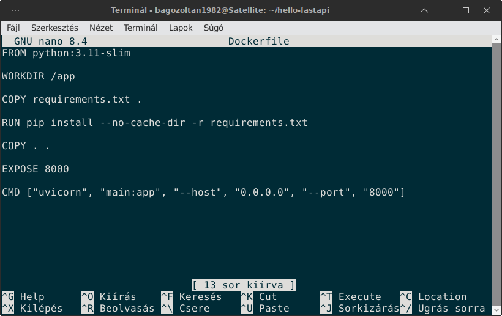

Láthatjuk, hogy a 4. lépésnek, a RUN esetében, nagyon nagy jelentősége van.

### Lemezkép építése
Mentsük el a fájlt és utánna építsük fel a lemezképet. 

    docker build -t hello-fastapi .

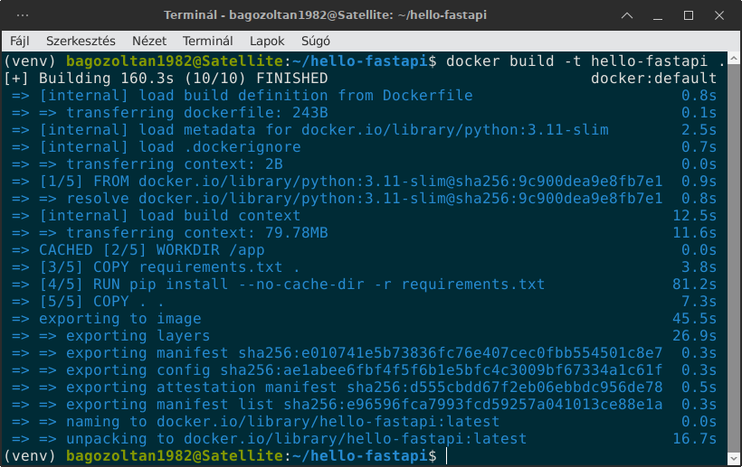

Mint ahogy az fentebb látható minden rendben történt. A 4. lépés volt a leghosszabb, mert le kellett tölteni a csomagokat.

Nézzük meg, hogy áll a lemezképünk:

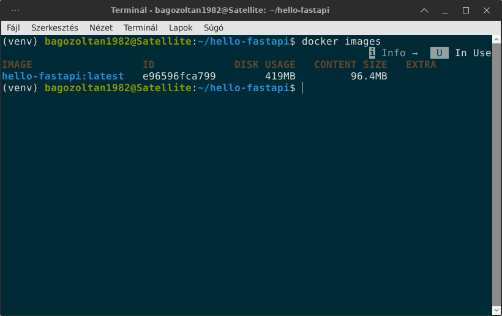

### Lemezkép futtatása
Létre jött a szükséges lemezkép és készen áll arra, hogy futtassuk.

    docker run -p 8000:8000 hello-fastapi

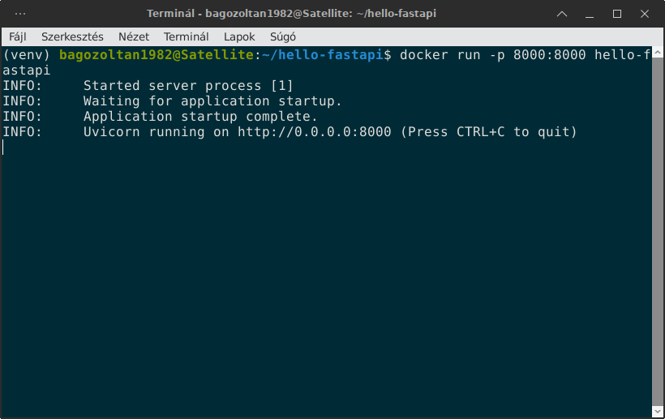

A Docker konténer sikeresen elindult és a http://localhost:8000 porton elérhetővé vált:

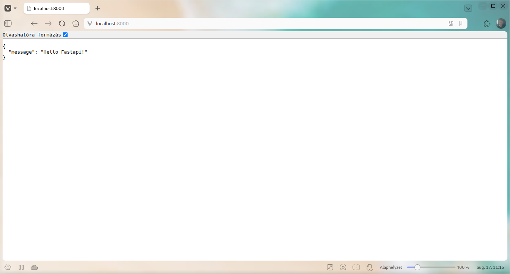

Nézzük meg a konténer adatait:

    docker ps -a

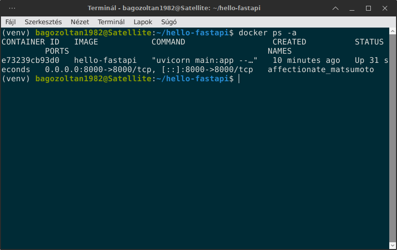

A konténert állítsuk le:

    docker stop e73239cb93d0

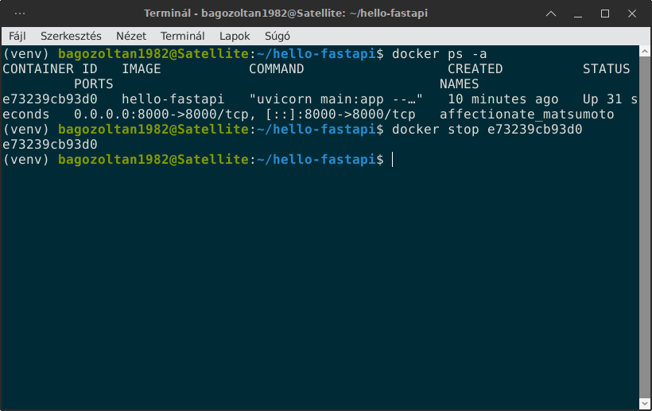

A Docker konténerünk megfelelően müködik. 

### Dockerignore 
Hozzuk létre a .dockeringore nevű fájlt:

    # Figyelmen kívül hagyandó Docker specifikus fájlok
    Dockerfile
    .dockerignore

    # Git és verziókövetés
    .git
    .gitignore

    # Python és Virtuális Környezet
    venv
    env
    __pycache__
    *.pyc

    # Titkos adatok és Logok
    .env
    local_settings.py
    *.log
    db.sqlite3

    # IDE és Rendszerfájlok
    .vscode
    .idea
    .DS_Store

A következő lépés a GitHub repóba történő feltöltés.

## Git & GitHub
### Gitignore
Hozzuk létre a .gitignore fájlt:

    nano .gitignore

A .gitignore tartalma:

    # Python és virtuális környezet
    venv/
    env/
    __pycache__/
    *.pyc
    *.log

    # Django SQLite adatbázis
    db.sqlite3
    *.sqlite3

    # Média és statikus fájlok
    /media
    /staticfiles

    # Titkos konfigurációs fájlok
    .env
    local_settings.py

    # IDE-k és Rendszerek
    .vscode/        
    .idea/          
    *.sublime-project
    *.sublime-workspace

    # Operációs Rendszer
    .DS_Store       
    Thumbs.db       
### Git beállítása
Állítsuk be a Git könyvtárat:

    $ git init

    Initialized empty Git repository in /home/bagozoltan1982/hello-fastapi/.git/

Ellenörizzük a helyi könyvtárunk állapotát:

    git status

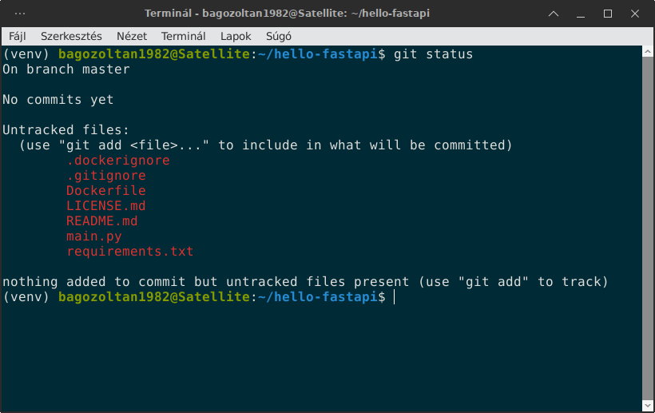

Még nincsen semmi sem hozzáadva és commitolva.

Adjuk hozzá a szükséges fájlokat:

    git add --all 

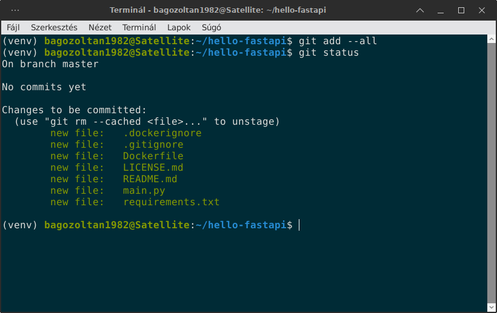

Az összes fájlt hozzá adtuk. Ezután commitolni kell:

    git commit -m "first commit"

A commit után alkalmazzuk a git branch parancsot:

    git branch -M main

Ezután jön a lényeg. Meg kell adnunk a távoli (remote) utvonalat a reponkhoz:

    git remote add origin git@github.com:ZoltanBago/hello-fastapi.git

Jelen esetben az erősebb SSH megoldást alkalmazzuk. Ha minden rendben történt, akkor az utolsó lépés a push parancs alkalmazása:

    git push -u origin main 

## Licenc

Ez a projekt a [CC BY-NC 4.0](https://creativecommons.org/licenses/by-nc/4.0/) licenc alatt érhető el.  

Szabadon másolható, tanulmányozható és módosítható **nem kereskedelmi célra**, a szerző (Bagó Zoltán) nevének feltüntetése mellett.

Kereskedelmi felhasználás esetén külön engedély szükséges.

 

